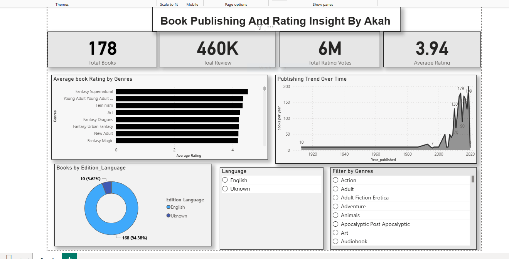

 # Book_Publishing_and_Rating_Intelligence_Dashboard
 
 Executive Summary  
This project delivers an end-to-end data analytics solution analyzing book publishing trends, reader engagement, and genre performance.  

Using Python for data preprocessing and Power BI for visualization, the analysis transforms raw publishing data into actionable insights that can support strategic decisions in the publishing industry.

The objective was to uncover trends in publishing activity, reader behavior, and genre performance to enable data-driven business decisions.

## Business Objective  

Publishing companies require insights to:  

- Identify high-performing genres  
- Understand reader engagement patterns  
- Track publishing growth over time  
- Analyze language distribution across markets  
- Monitor rating trends and audience preferences  

This dashboard provides stakeholders with an interactive view of these key performance indicators.

## Technology Stack  

- *Python (Pandas, NumPy)* – Data cleaning & transformation  
- *Jupyter Notebook* – Data preprocessing workflow  
- *Microsoft Power BI* – Data modeling & interactive visualization  
- *CSV Dataset* – Source data  

## End-to-End Workflow  

1. Raw dataset imported into Python  
2. Data quality assessment (null values, duplicates, inconsistencies)  
3. Data transformation and feature formatting  
4. Cleaned dataset exported to CSV  
5. Data modeled in Power BI  
6. Interactive dashboard built with KPI metrics and filters  

## Key Performance Indicators (KPIs)

- *Total Books:* 178  
- *Total Reviews:* 460,000  
- *Total Rating Votes:* 6,000,000  
- *Average Rating:* 3.94  
- *Primary Language:* English (94%)  

## Analytical Insights  

- Publishing activity significantly increased after the year 2000  
- English dominates the publishing landscape  
- Certain genres consistently outperform others in average rating  
- High review volume strongly correlates with rating visibility  
- Reader engagement varies significantly across genres  

## Dashboard Preview  

## Analytical Value Delivered  

This project demonstrates the ability to:  

- Perform structured data cleaning and validation  
- Translate business questions into measurable KPIs  
- Build interactive dashboards for executive-level reporting  
- Communicate insights clearly and professionally  
- Deliver an end-to-end analytics pipeline  

## Repository Structure  

 Book_Publishing_and_Rating_Intelligence_Dashboard

 -README.md
 -Book_Publishing_Dashboard.pbix
 -Book dataset.csv
 -Cleaned_data.ipynb
 -Dashboard.PNG

## How to Reproduce  

1. Run data_cleaning.ipynb to preprocess the raw dataset  
2. Use the cleaned CSV output  
3. Open the .pbix file in Power BI Desktop  
4. Interact with slicers and filters to explore insights  

## Author  

*Ebenezer Akah*  
Data Analyst | Business Intelligence Enthusiast  
Focused on transforming raw data into strategic insights  

## Future Enhancements  

- Sentiment analysis on reader reviews  
- Predictive modeling for rating trends  
- Expanded dataset for cross-country analysis  
- Deployment as an interactive web-based dashboard
